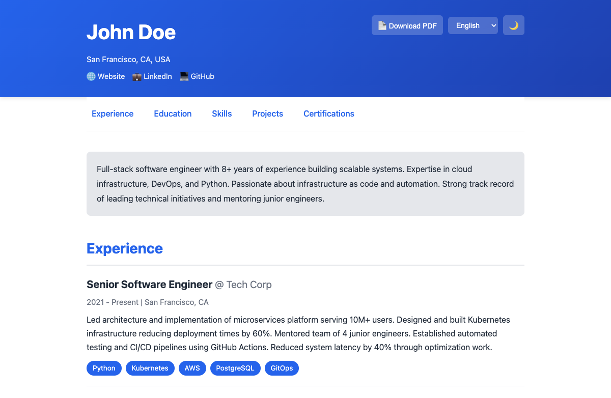

# resume as Code ✨

> **Infrastructure-as-Code for your resume**. Single YAML source of truth,
> automatic multi-format generation, version-controlled career history.

[](https://github.com/Esysc/resume-as-code/actions/workflows/deploy.yml)
[](https://esysc.github.io/resume-as-code/)




## 🎯 Why Resume as Code?

Traditional resume builders force you into templates and web UIs.
CV as Code treats your resume like **infrastructure**:

- **Single Source of Truth** — Edit YAML once, generate everywhere
- **Version Control** — Git history of your career evolution
- **Multi-Language** — Single data, multiple languages (EN/FR/IT)
- **Automation** — GitHub Actions auto-generates on every commit
- **Privacy** — Code stays private, CV is public on GitHub Pages
- **Modern Stack** — Python backend + React frontend
- **Multi-Format** — HTML / JSON / PDF from same source
- **Privacy Controls** — Sensitive info (email/phone) hidden in web interface

### The Philosophy

```text
Your CV Data (YAML)
        ↓
Python Generators (validate, transform)
        ↓
Multiple Outputs (HTML, JSON, PDF)
        ↓
GitHub Pages (public) + Git History (version control)
```

## 🚀 Quick Start

### 1. Fork or Clone

```bash
git clone https://github.com/YOUR_USERNAME/cv-as-code.git
cd cv-as-code
```

### 2. Install Dependencies

```bash
# Backend
pip install -r backend/requirements.txt

# Frontend
cd web
npm install
cd ..
```

### 3. Customize Your resume

Edit `cv-data/cv_en.yml`:

```yaml
personal:
  name: Your Name
  email: your@email.com
  phone: "+1-234-567-8900"
  location: City, Country
  birth_date: 1990-01-01

summary: "Your professional summary..."

experience:
  - id: exp_1
    company: Your Company
    title: Your Title
    period: 2020 - Present
    location: City
    technologies:
      - Python
      - Kubernetes
    description: "Your achievements..."
```

See [CV_SCHEMA.md](docs/CV_SCHEMA.md) for complete documentation.

### 4. Generate Outputs

```bash
python backend/generate.py
```

Generates:

- `dist/index.html` — Static HTML
- `dist/cv.json` — JSON API
- `dist/cv.pdf` — PDF export

### 5. Preview Locally

```bash
# Start dev server (port 3000)
cd web && npm run dev
```

### 6. Deploy

Push to GitHub and enable GitHub Pages:

```bash
git add .
git commit -m "Update CV"
git push origin main
```

GitHub Actions automatically:

1. Generates HTML/JSON/PDF
2. Builds React app
3. Deploys to GitHub Pages

Your resume is now live at: `https://YOUR_USERNAME.github.io/resume-as-code`

## 📚 Features

### ✅ Current (Stable)

- Multi-language support (EN/FR/IT) with externalized translations
- Dynamic language selector
- Dark mode toggle
- Version control (Git history)
- HTML/JSON/PDF exports
- Responsive design
- GitHub Pages deployment
- CI/CD automation
- Privacy controls (sensitive info hidden in web interface)
- Complete CV sections: Personal, Summary, Experience, Education, Skills,
  Projects, Certifications, Languages

### 🚧 Planned (Roadmap)

- Resume PDF parser (local CLI)
- Multiple templates
- Skills proficiency levels
- Certifications with verification
- Timeline visualizations
- SEO optimization
- Theme customization UI

See [ROADMAP.md](docs/ROADMAP.md) for details.

## � Multi-Language Translation

The project uses **English as the base language**. Translation files (French,
Italian) only need to contain fields that require translation — all other data
is automatically inherited from `cv_en.yml`.

### How It Works

```text
cv_en.yml (base)          cv_fr.yml (overrides)
─────────────────         ────────────────────
personal:                 # Not needed - inherited
  name: John Doe
  email: john@example.com
  company: Tech Corp      # Not needed - inherited

summary: "Full-stack      summary: "Ingénieur
  engineer..."              full-stack..."

experience:               experience:
  - id: exp_1               - id: exp_1
    company: Tech Corp        title: "Ingénieur Senior"
    title: "Senior Eng"       description: "Dirigé..."
    period: 2021-Present
    description: "Led..."
```

### What to Include in Translation Files

| Include (translated)         | Exclude (inherited from English) |
| ---------------------------- | -------------------------------- |
| `summary`                    | `personal` (name, email, etc.)   |
| `experience[].title`         | `experience[].company`           |
| `experience[].description`   | `experience[].period`            |
| `education[].degree`         | `experience[].technologies`      |
| `education[].description`    | `education[].school`             |
| `skills[].category`          | `education[].graduation_year`    |
| `projects[].title`           | `projects[].url`                 |
| `projects[].description`     | `projects[].technologies`        |
| `languages[].name`           | All URLs, dates, company names   |
| `languages[].level`          |                                  |

### Matching by ID

List items (experience, education, projects) are matched by their `id` field:

```yaml
# cv_en.yml
experience:
  - id: exp_1
    company: Tech Corp
    title: Senior Engineer

# cv_fr.yml - only override translated fields
experience:
  - id: exp_1
    title: Ingénieur Senior
    # company inherited from English
```

## 🏗️ Architecture

```text
cv-as-code/
├── cv-data/                    # Your CV data
│   ├── cv_en.yml              # English (base - complete data)
│   ├── cv_fr.yml              # French (translations only)
│   ├── cv_it.yml              # Italian (translations only)
│   └── ui_translations.yml    # UI text translations
│
├── backend/                    # Python infrastructure
│   ├── generate.py            # Main entry point
│   ├── parsers/
│   │   ├── yaml_parser.py     # Parse YAML + merge translations
│   │   └── schema.py          # Validate schema
│   ├── generators/
│   │   ├── html_generator.py  # → HTML
│   │   ├── json_generator.py  # → JSON
│   │   └── pdf_generator.py   # → PDF
│   └── templates/
│       └── cv.html            # Jinja2 template
│
├── web/                        # React frontend
│   ├── src/
│   │   ├── App.jsx
│   │   ├── components/
│   │   ├── styles/
│   │   └── utils/
│   ├── public/
│   │   ├── cv.json            # Generated
│   │   └── cv.pdf             # Generated
│   └── vite.config.js
│
└── .github/workflows/
    └── deploy.yml             # CI/CD pipeline
```

## 🛠️ Tech Stack

| Layer | Technology | Why |
| ----- | ---------- | --- |
| **Data** | YAML | Human-readable, version-controllable |
| **Backend** | Python 3.9+ | Parsing, validation, generation |
| **Validation** | Pydantic | Type safety, schema enforcement |
| **Templates** | Jinja2 | Flexible HTML generation |
| **PDF** | WeasyPrint | Pure Python, no browser needed |
| **Frontend** | React 19 | Modern, component-based |
| **Styling** | Tailwind CSS | Utility-first, customizable |
| **Build** | Vite | Fast, modern bundler |
| **Deploy** | GitHub Pages | Free, automated |

## 📖 Documentation

- [GETTING_STARTED.md](docs/GETTING_STARTED.md) — Detailed setup guide
- [CV_SCHEMA.md](docs/CV_SCHEMA.md) — Complete YAML structure
- [CUSTOMIZATION.md](docs/CUSTOMIZATION.md) — Styling and theming
- [ARCHITECTURE.md](docs/ARCHITECTURE.md) — System design
- [ROADMAP.md](docs/ROADMAP.md) — Future features
- [CONTRIBUTING.md](CONTRIBUTING.md) — How to contribute

## 🔄 Workflow Examples

### Example 1: Update CV and Auto-Deploy

```bash
# Edit cv_en.yml
nano cv-data/cv_en.yml

# Commit and push
git add cv-data/cv_en.yml
git commit -m "Update: Added new project"
git push

# ✅ GitHub Actions auto-generates outputs
# ✅ CV is live in ~30 seconds
```

### Example 2: Create Role-Specific PDF (Local)

```bash
# For a data engineering position
git checkout -b feature/cv-dataeng

# Edit cv_en.yml emphasizing data/analytics skills
nano cv-data/cv_en.yml

# Generate PDF locally
python backend/generate.py

# Send dist/cv.pdf to recruiter
# Don't push this branch—it's local only
git checkout main
```

### Example 3: Multi-Language Support

Public website automatically shows language selector:

- English (default)
- Français
- Italiano

Users can switch languages on the fly.

## 🎨 Customization

### Change Colors

Edit `web/src/styles/App.css`:

```css
:root {
  --primary: #2563eb;    /* Primary color */
  --secondary: #64748b;  /* Secondary color */
  --accent: #f97316;     /* Accent color */
}
```

### Change Template

Edit `backend/templates/cv.html` to modify layout, typography, etc.

### Add Sections

Edit `cv-data/cv_en.yml` and `backend/templates/cv.html` in parallel.

## 📦 Deployment

### GitHub Pages (Recommended)

1. Push code to GitHub
2. Enable GitHub Pages in repo settings
3. GitHub Actions handles the rest

Your CV is live at: `https://USERNAME.github.io/cv-as-code`

### Other Platforms

The `dist/` folder is fully static—deploy to:

- Netlify
- Vercel
- Firebase Hosting
- AWS S3 + CloudFront
- Any static host

## 🔐 Privacy

- **Private Repo** — Source code stays private
- **Public CV** — Resume is publicly accessible via GitHub Pages
- **No Backend** — No server to compromise (static site)
- **Git History** — Only you control your data

## 🛠️ Development

### Prerequisites

- Python 3.9+
- Node.js 18+
- Git
- VS Code (recommended)

### VS Code Setup

The project includes VS Code workspace configuration:

1. **Automatic Environment**: VS Code will automatically use the
   virtual environment
2. **Recommended Extensions**: Install suggested extensions for
   Python, React, and YAML
3. **Debug Configurations**: Pre-configured launch options for
   running and debugging
4. **Tasks**: Quick access to common development commands via
   Ctrl+Shift+P → "Tasks: Run Task"

### Setup

```bash
# Clone repository
git clone https://github.com/YOUR_USERNAME/cv-as-code.git
cd cv-as-code

# Install dependencies
make install

# Generate CV outputs
make generate

# Run tests
make test

# Start development server
make dev
```

### Available Commands

```bash
make help          # Show all available commands
make install       # Install all dependencies
make generate      # Generate CV outputs (HTML/JSON/PDF)
make test          # Run test suite
make dev           # Start development server
make build         # Build for production
make clean         # Remove generated files
make lint          # Lint code
```

### Testing

The project includes automated tests for:

- PDF generation with professional styling
- Multi-language support
- Schema validation
- Output format verification

```bash
# Run all tests
make test

# Run specific test file
pytest tests/test_pdf_generation.py -v
```

### Pre-commit Hooks

Pre-commit hooks are configured to:

- Validate CV YAML schema
- Format Python code (black, isort, flake8)
- Format JavaScript/React code (prettier)
- Lint Markdown files
- Check for TODO/FIXME comments
- Auto-generate CV files on changes

```bash
# Install pre-commit hooks
pre-commit install

# Run hooks manually
pre-commit run --all-files
```

### CI/CD

GitHub Actions automatically:

- Runs pre-commit checks on pull requests
- Executes test suite
- Builds and deploys on main branch pushes
- Validates CV data schema
- Ensures code quality standards

## 🤝 Contributing

Contributions welcome! See [CONTRIBUTING.md](CONTRIBUTING.md) for guidelines.

### Areas for Contribution

- 🎨 **Templates** — Minimal, sidebar, creative layouts
- 🌍 **Translations** — Spanish, German, Chinese, Japanese
- 🐛 **Bug fixes** — Quality improvements
- 📝 **Documentation** — Guides, examples, tutorials
- ✨ **Features** — From [ROADMAP.md](docs/ROADMAP.md)

## 📊 Project Status

- **Version:** 1.0.0
- **Status:** Production-ready, actively maintained
- **License:** MIT
- **Last Updated:** January 2026

## 📋 License

MIT — See [LICENSE](LICENSE) for details.

Free to use, modify, and distribute.

## 🙌 Acknowledgments

Inspired by:

- Infrastructure-as-Code principles
- Version control best practices
- Modern DevOps workflows

## 💬 Questions?

- Open an [Issue](https://github.com/YOUR_USERNAME/resume-as-code/issues)
- Check [Documentation](docs/)
- See [FAQ](docs/FAQ.md)

---

**Made with ❤️ for developers who think infrastructure-first.**

⭐ If you find this useful, please star the repo!
